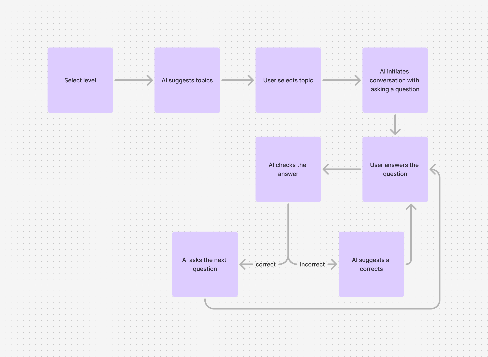
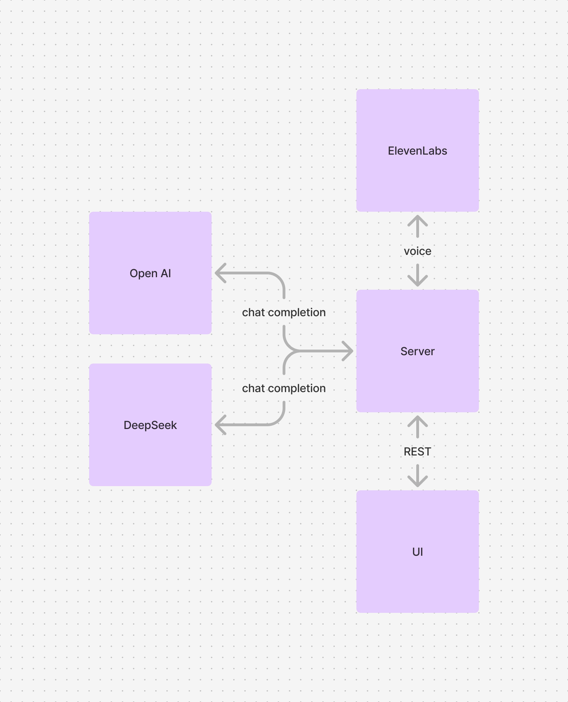

# Quassle

The Voice AI Assistant is an interactive tool designed to enhance German language learning by providing tailored experiences for users at different skill levels.

## Key Features

### 1. Level Selection
- Users begin by selecting their current proficiency level in German.

### 2. Topic Customization
- The assistant suggests **10 topics** based on the selected level.
- Users choose a topic to focus on.

### 3. Interactive Conversations
- The assistant initiates a conversation by asking questions in **German speech**.
- Users respond to the questions, enabling a dynamic and immersive learning experience.

### 4. Progress Assessment
- After a few responses, the assistant:
  - Evaluates the user's performance.
  - Suggests adjustments to the proficiency level if necessary.
- Real-time feedback is provided:
  - Correct answers lead to follow-up questions to maintain conversational flow.
  - Incorrect answers are addressed with explanations and repetition opportunities.

### 5. Error Handling and Guidance
- For incorrect answers:
  - The assistant explains what went wrong.
  - Users are prompted to repeat the response for better retention.

### 6. Session Summary
- At the end of each session, the assistant provides:
  - A **vocabulary list** of new or important words covered.
  - Recommendations for **grammar topics** to focus on for further improvement.

---

This assistant is designed to create an engaging, adaptive, and supportive environment for learning German, ensuring that learners can practice and improve their skills effectively.

## Post MVP ideas

- level assesment
- options
  - time box
  - number of iterations
  - interaction mode
    - correction after every sentence
    - summary at the end
- languages
- "repeat the question functionality (btn)"

## Language levels

- Beginner
- Intermidiate
- Andvanced

## User flow

## Architecture

